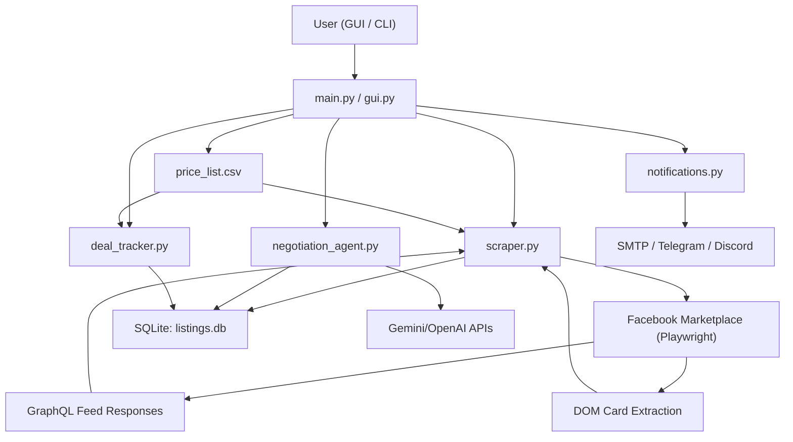
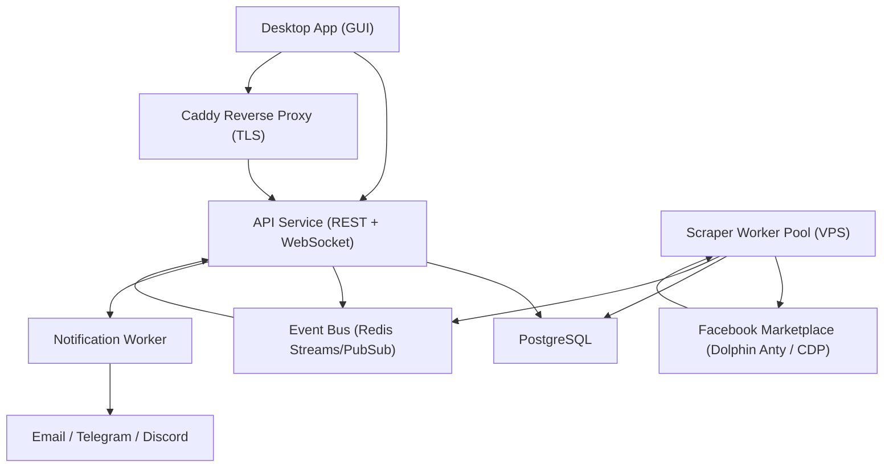

# iPhone Flipper Architecture

## 1. Purpose and Scope

This document describes the current system architecture for the `iphone_flipper` application used to discover, evaluate, negotiate, and track iPhone flipping opportunities from Facebook Marketplace (Perth region).

Scope includes:

- Scraping and ingestion
- Pricing and condition evaluation
- GUI and CLI orchestration
- Negotiation AI integration
- Notifications
- Deal tracking and learning
- Operational and risk controls
- 24x7 server migration and real-time desktop synchronization target architecture

## 2. System Context

The system is a local-first Python application with:

- **Execution layer**: CLI (`main.py`) and desktop GUI (`gui.py` via `run_gui.py`)
- **Acquisition layer**: Hybrid Marketplace fetch — V1 in Playwright (`scraper/` package — `core.py`, `parsers.py`, `browser.py`, `storage.py`, `proxy.py`, `config.py`, `legacy_utils.py`), V2.2 via Dolphin Anty CDP (`core/scraper/` package — `driver.py`, `pipeline.py`, `parser.py`, `storage.py`, `config.py`)
- **Decision layer**: model identification, condition assessment, max-offer/profit computation
- **Interaction layer**: AI-assisted negotiation (`negotiation_agent.py`)
- **Learning layer**: purchase analytics + conversion scoring (`deal_tracker.py`)
- **Alerting layer**: email/Telegram/Discord notifications (`notifications.py`)
- **Configuration layer**: GUI-managed account/proxy/settings control (`gui.py` + SQLite config tables)
- **Persistence**: SQLite (`listings.db`) + CSV pricing sheet (`price_list.csv`)

Target direction (approved migration path):

- **Server execution layer**: VPS-hosted scraper workers + API service
- **Streaming layer**: event bus for per-listing insert/update events
- **Server persistence**: centralized PostgreSQL for listings/conversations/purchases/settings
- **Desktop sync layer**: WebSocket client in local GUI for real-time listing updates
- **Desktop role**: operator console (review, negotiation, deal tracking), no longer long-running scraper host

V3.0 upgrade guardrails (approved for the latency/responsiveness track):

- Phase 0 is instrumentation + rollout-control scaffolding only: Redis-backed flags and JSON observability without changing current payload contracts.
- Explicit non-goals for this track:
  - no separate raw HTTP scraper driver as the primary discovery path
  - no token extraction/replay architecture outside the browser as the main runtime mode
  - no proxy/fingerprint escalation intended to preserve large-scale account automation
  - no profile role-segregation specifically for anti-spam evasion
  - no notification-before-persistence flow
- Current baseline remains Redis pub/sub + API WebSocket endpoint + GUI polling sync, with V3.0 Phase 1 adding Redis Streams dual-write after persistence behind `ENABLE_REDIS_STREAM_EVENTS` and V3.0 Phase 2 adding an optional Redis Streams notification consumer behind `ENABLE_NOTIFICATION_CONSUMER`; later phases may formalize WebSocket-first desktop sync only after approval.

## 3. High-Level Component Diagram

Target 24x7 runtime architecture:

## 4. Runtime Architecture

### 4.1 Scrape and Ingest Flow

1. User triggers scrape from CLI (`main.py scrape`) or GUI (`Run Scraper`).
2. `scraper.scrape_marketplace()` launches persistent Chromium profile (GUI/CLI orchestrators pass per-account profile paths; direct module execution defaults to `browser_profile/`).
2.1 V2.2 worker path: `core/scraper/driver.py` starts a Dolphin Anty profile via local API (`GET /v1.0/browser_profiles/{id}/start?automation=1`), receives a CDP WebSocket endpoint, and connects via `playwright.chromium.connect_over_cdp()`. If the profile is already running (`E_BROWSER_RUN_DUPLICATE`), the driver attempts an explicit stop and restarts with exponential backoff retries. WebSocket endpoint is constructed as `ws://{DOLPHIN_WS_HOST}:{port}{wsEndpoint}` where `DOLPHIN_WS_HOST` defaults to `127.0.0.1` (worker containers use `network_mode: host` to reach the host-bound Chrome DevTools port). Stealth/fingerprinting is delegated to Dolphin Anty's native anti-detect engine. To prevent failure loops, a distributed PostgreSQL-backed Per-Profile Health Tracker (`proxy_stats` table) monitors consecutive Dolphin profile failures across all workers. If a profile fails repeatedly, it is temporarily blacklisted with exponential backoff (starting at 30 minutes, up to 24 hours) and bypassed across all workers during selection.
3. Queries load from DB-backed `search_queries` (`is_active=1`) with fallback to seeded defaults.
4. During each query run, response listeners capture Marketplace GraphQL payloads (`/api/graphql/`) and normalize listing fields.
5. DOM card extraction runs as fallback and backup enrichment source.
6. Progressive scrolling now targets the actual Marketplace feed scroll container (not only `window.scrollBy`) and continues until target depth or sustained no-growth stall.
7. DOM candidates are captured cumulatively across scroll snapshots (virtualized feed safe), then merged with GraphQL candidates by listing ID, preferring richer records and backfilling missing fields.
8. Each new listing is enriched with:
   - model (`identify_model`)
   - condition (`assess_condition` keyword rules)
   - max offer and expected profit (`calculate_max_offer`, `calculate_profit_for_listing`)
8.1 Listings are persisted only when detected model exists in current `price_list.csv` scope (price-sheet model whitelist).
9. Price normalization handles mixed Marketplace formats (`$300`, `300 AU$`, `1.000 AU$`) and falls back to currency-tagged title/description parsing when structured price fields are missing.
9.1 Listing URLs are canonicalized to `https://www.facebook.com/marketplace/item/<listing_id>/` (tracking query params removed).
10. Accessory-only posts are suppressed via heuristic filtering (e.g., case/cover/protector/charger listings without handset sale signals), with operator-tunable keyword and max-price settings stored in `scraper_settings`.
11. Listings are written into `listings` table with status:

- `new` (model recognized and priced)
- `needs_pricing` (model recognized but absent in CSV)
- `unclassified` (model unknown)
11.1 Current ingest scope is constrained to price-sheet models only; listings with unknown/out-of-sheet models are skipped at save time.

1. Each inserted listing is committed immediately (no run-end batch wait) and emits `listing_saved` progress events with listing payload.
2. Additional listing metadata is persisted when available: `location`, `description`, `seller_name`.
3. Processed queries stamp `search_queries.last_polled` for scheduling/health visibility.
4. Post-scrape score refresh runs (`deal_tracker.update_listing_conversion_scores`).
5. Notifications are controlled by `notify_profitable_only` setting (profitable subset when enabled, all new listings when disabled).

### 4.2 GUI Flow

- Main frame has tabs for Listings, Negotiation, Deals.
- Scraper runs in background thread with progress callback and cancel support.
- Scraper menu includes a dedicated `Worker Queries & Keywords` manager for editing per-worker route query CSV and universal accessory/negative keyword set.
- Query manager is worker-scoped (`worker`, `worker_2`, `worker_3`) and applies shard updates across all routes/profiles under the selected worker.
- Listings table supports quick filters (All/New/High-Profit/iPhone14+), advanced filtering (multi-select model dropdown, profit min/max range, minimum price), opening URLs, negotiation start, purchase marking, right-click color flags (`scam`, `interested`, `not_interested`), opened-row visual marking (`opened_at`), and bulk multi-select delete/mark actions.
- Listings feed now suppresses rows where model is blank or `Unknown`; those rows remain stored in DB but are hidden from operator feed and model-filter dropdown.
- Price Sheet editor supports in-app row CRUD + CSV save + full listing recalculation.
- Price Sheet editor primary action label is `Apply Changes` (writes CSV + recalculates listings).
- Price Sheet save/recalculation enforces scope: managed listings whose model is no longer present in price sheet are purged from queue.
- Settings manager provides:
  - Two-tab operator surface: `Proxies` (inventory/import) + `VPS Scrapers` (remote route orchestration)
  - VPS Scrapers tab uses a scrollable container so route actions remain reachable on smaller screens
  - `Proxies` tab retains manual/API proxy onboarding for reusable credentials/endpoints
  - `Proxies` tab now renders server proxy-health columns (`Failures`, `Banned`, `Ban Until`) from API `proxy_stats`
  - `Proxies` tab now provides per-proxy ban reset action for selected endpoint (`/proxy-stats/reset`)
  - Accessory-only suppression controls (`accessory_filter_keywords`, `accessory_filter_max_price`) are editable in Settings and persisted in SQLite
  - Desktop server-sync upsert path now runs local accessory-only purge after each batch to prevent stale accessory rows from lingering in GUI
  - Saving VPS connection settings also pushes accessory-filter values to VPS worker runtime DBs over SSH for server-side consistency
  - VPS accessory-filter sync now auto-repairs worker runtime DB permissions (`docker compose exec -u 0` + ownership fix) and retries writes when SQLite reports readonly-state errors; repair scope is constrained to the target DB dir/file (non-recursive)
  - Route-level worker/profile/proxy/query-shard assignment for server-side scraping only
  - Proxy-profile selection to quickly assign existing SOCKS5 routes to new scraper profiles
  - VPS manual login action (`Manual Login (SOCKS5)`) that auto-suggests profile dir, auto-suggests route name when missing, saves/upserts route before launch, runs remote mkdir/bootstrap commands, and launches proxied browser login on VPS
  - VPS manual login now performs best-effort profile ownership/permission repair before browser launch and treats cookie pre-check permission denials as non-fatal diagnostics
  - VPS manual login now defaults to `google-chrome` when present, auto-starts a local proxy-auth bridge on VPS for username/password SOCKS5 endpoints, auto-detects VNC/X11 display (`Xtigervnc :1`) and reports pre-launch FB cookie/proxy-egress checks
  - Route onboarding now prefers active workers (`worker`, `worker_2`, `worker_3`) and auto-remaps non-running worker targets so new profiles join rotation immediately
  - VPS connection controls (`server_api_*`, `server_sync_*`, `server_ssh_*`) and monitor actions
  - VPS Activity Monitor `Worker Logs (Live)` stream renders continuous `docker compose logs -f` output in-panel with stop control
  - VPS Telegram verification action (`Send Telegram Test`) that executes from running worker env to confirm real `TELEGRAM_BOT_TOKEN` + `TELEGRAM_CHAT_ID` delivery path
  - `Dolphin Profiles` tab with profile table (ID, Name, Status, Browser, Tags, Memory), Fetch/Start/Stop profile controls via Dolphin Anty API (configurable URL, defaults to `http://localhost:3001`) (requires the Dolphin Anty desktop application to be running to expose the API port), API key masked entry + instant save, and `Authorization: Bearer` header injection on all Dolphin API requests
  - `dolphin_api_key` and `dolphin_api_url` persisted in `scraper_settings` and loaded on Settings open
  - Persisted runtime controls including local scraper paging depth (`scrape_scroll_target_cards`, `scrape_scroll_max_rounds`)
  - Route bootstrap visibility: pre-seeded VPS routes can be fetched and edited directly from GUI via `GET /worker-routes`
  - VPS monitoring visibility in GUI route table/form now includes per-worker proxy lease state and route cooldown/waiting state (no log tail required)

### 4.3 Negotiation Flow

1. Listing selected in GUI or CLI command.
2. Context is fetched from DB (`listing + conversation history`).
3. AI provider is resolved from auth config/environment.
4. Message generation uses:
   - Gemini `gemini-3-flash-preview` or
   - OpenAI `gpt-4o-mini`
5. Messages are persisted to `conversations`.
6. Listing status may transition (`contacted`, `pending_review`).

### 4.4 Learning and Analytics Flow

1. Purchases are recorded with metadata (`mark_as_purchased`).
2. Pattern aggregates are recomputed (`analyze_patterns`) and persisted to `conversion_patterns`.
3. Active listings are rescored (`calculate_conversion_score` + `update_listing_conversion_scores`).
4. Insights derive from model/condition/keyword outcomes.

### 4.5 24x7 Server Flow (Baseline Implemented, Desktop Sync Pending)

1. VPS supervisor launches a long-running scraper worker pool.
2. Each worker container runs a single sequential scrape loop via `_run_worker_loop()`. The loop selects routes, acquires leases, and executes scrape cycles one at a time. Parallelism is achieved via multiple Docker worker containers (`worker`, `worker_2`, `worker_3`).
3. Each loop iteration pulls its enabled route set (`worker_routes`) and selects the next **due** route using persisted `next_run_at` (NULL treated as immediately due) instead of in-memory round-robin.
2.1 Route cadence uses runtime-compensated sleep (`max(0, interval - elapsed)`) plus configurable jitter to keep effective scrape frequency aligned to config.
2.2 If no route is currently due, worker sleeps until the nearest `next_run_at` (or earliest cooldown release) with jitter, rather than fast-looping.
2.3 If DB routes exist but are temporarily unavailable (cooldown/proxy lock), worker waits in scheduled/cooldown state rather than falling back to `env_default`.
2.4 `env_default` fallback is used only when no DB routes exist for that worker.
4. Every discovered listing is normalized/enriched and **upserted immediately** (per listing, not end-of-run batch commit).
3.1 `worker_3` fast-lane profile is supported for broad `iPhone` sweeps with short interval + medium-depth scroll controls (target cards capped at 100) to prioritize newly listed posts.
3.2 Marketplace queries use explicit newest-first ordering (`sortBy=creation_time_descend`) and enforce at least one scroll pass before target-card early exit.
3.3 Worker supports weighted bucket query diversification (`_get_bucket_queries`) with four categories: broad (40%), exact model (30%), flipper/deal-hunter (20%), misspelling (10%). When route `search_queries` is empty or `BUCKETS`, 3 random weighted queries are selected per cycle.
5. Each insert/update emits an event (`listing_created` / `listing_updated`) to a broker.
6. Worker heartbeat/status is upserted into `worker_heartbeats` for operator visibility.
5.1 Worker routes are marked `degraded` when all query results return `page_cards=0` (profile likely unhealthy), with error context persisted for operators.
5.2 `GET /worker-health` now enriches each worker heartbeat row with active proxy lease metadata and route cooldown remaining seconds for GUI monitoring.
5.3 Worker cycles with zero executed queries are now treated as bad cycles so degraded/cooldown/telegram-failure flow can trigger instead of silently passing.
5.4 Proxy starvation/proxy-mismatch/profile lock/query-shard contention are represented as WAIT outcomes (`WAIT_PROXY`, `WAIT_PROXY_MISMATCH`, `WAIT_PROFILE_LOCK`, `WAIT_QUERY_SHARD`) and do not count toward route bad-cycle/cooldown transitions.
5.5 Pre-checkpoint soft-signal analysis can proactively throttle/pause routes (`WAIT_SIGNAL_PAUSE`) before hard checkpoint/quarantine conditions.
5.6 Error-category-aware retry/backoff is applied per cycle (transient categories retry with exponential backoff; deterministic categories fail fast).
5.7 Route status state machine is persisted (`ENABLED`, `DEGRADED`, `THROTTLED`, `COOLDOWN`, `NEEDS_LOGIN`, `DISABLED`) with status reason/timestamp and interval multipliers; expired cooldown windows are auto-released to `ENABLED`.
5.8 Proxy selection uses health memory (`proxy_stats`) to deprioritize/ban failing proxies instead of random retry churn.
5.9 Every cycle emits structured JSON telemetry (`cycle_id`, `route_name`, `proxy_key`, `query_shard_key`, `duration_ms`, `outcome`, `error_category`, `retry_count`) for diagnostics.
5.10 Manual-login quarantine state now persists incident metadata (`quarantined_at`, `quarantine_reason`, `quarantine_evidence`) and supports API/GUI recovery actions (route retest and worker-level bulk clear).
5.11 Worker cycles can apply coherent browser personas (`ENABLE_FINGERPRINT_VARIATION`) and log `persona_hash`/persona context in telemetry for correlation diagnostics.
5.12 V3.0 Phase 0 adds a Redis-backed feature-flag registry (`flipper:flags`) with all upgrade-path flags defaulting to disabled: `ENABLE_REDIS_STREAM_EVENTS`, `ENABLE_NOTIFICATION_CONSUMER`, `ENABLE_GUI_WEBSOCKET_PUSH`, `ENABLE_PRIORITY_SCHEDULER`, and `ENABLE_ROUTE_LANES`.
5.13 V3.0 Phase 0 also adds JSON observability markers for `listing_seen_ts`, `listing_persisted_ts`, `listing_event_published_ts`, and inline `notification_sent_ts`, plus cycle-level latency aggregates for Postgres upsert, Redis publish, and end-to-end alert timing.
5.14 V3.0 Phase 1 adds an optional post-persistence Redis Streams dual-write path on `stream:listings` using `XADD ... MAXLEN ~ 10000`. The stream event schema is intentionally flat and compact (`schema_version`, `event_name`, `listing_id`, `worker_name`, `route_name`, `query`, `query_index`, `query_total`, `query_shard_key`, `persisted_at`, `price`, `potential_profit`, `title`, `url`, `source`) and reuses existing runtime metadata rather than inventing new persisted route/query IDs.
5.15 Phase 1 stream emission is gated by `ENABLE_REDIS_STREAM_EVENTS`, occurs only for newly created listings or meaningful hot-path state changes (`title`, `price`, `url`, `model`, `condition`, `status`, `max_buy_price`, `potential_profit`, `location`), and is non-fatal on publish failure. Existing Postgres upsert semantics, Redis pub/sub fanout, inline worker Telegram sends, API behavior, and the dormant notification worker remain unchanged in this phase. Stream publish IDs and latency/failure counters are exposed through JSON observability and cycle telemetry for rollout measurement.
5.16 V3.0 Phase 2 hardens the Phase 1 producer path with a transaction-level PostgreSQL advisory lock on `listing_id` before the read/upsert decision, so concurrent same-listing persistence resolves to one created-row path and suppresses duplicate stream emission for unchanged duplicates in the happy path.
5.17 V3.0 Phase 2 makes `notification_worker.py` a compose-wired Redis Streams consumer-group service over `stream:listings` using group `listing_notifications`, `XAUTOCLAIM` restart recovery, durable PostgreSQL ledger `notification_delivery_ledger`, immediate Telegram delivery paced to 1 notification per second, and retry/backoff for transient failures. When `ENABLE_NOTIFICATION_CONSUMER` is enabled and stream publish succeeds, the notification worker becomes the authoritative alert path and the scrape worker logs notification delegation instead of blocking on inline Telegram I/O.
7. API service relays events through Redis/WebSocket-compatible channels; Redis pub/sub remains the live API fanout path in Phase 2, and desktop currently consumes server changes via incremental cursor polling with direct WebSocket apply still pending.
7.1 V3.0 Phase 0 instruments API broadcast latency and GUI poll-sync render timestamps (`gui_pushed_ts`, `gui_rendered_ts`) without changing REST or WebSocket payload shapes.
8. Worker runtime can still send immediate Telegram listing cards on `listing_created` when `potential_profit >= TELEGRAM_NOTIFY_MIN_PROFIT` (default `0`) and model is not blank/`Unknown`, including link + price/profit/description summary, but this is now a fallback path used only when the dedicated notification consumer is disabled or stream delegation is unavailable.
9. Notification service architecture (implemented baseline + decoupled event-driven worker):
   - **Inline worker path**: fallback-only path when the dedicated notification consumer is disabled or when stream delegation is unavailable.
   - **Event-driven notification worker** (`notification_worker.py`): compose-wired Redis Streams consumer over `stream:listings` with consumer-group recovery, PostgreSQL-backed dedupe ledger, Telegram as required delivery path, optional best-effort FCM push, retry/backoff, and one-notification-per-second pacing.
9.1 The earlier worker pub/sub payload-shape mismatch is resolved in the approved upgrade path by moving notification delivery to the stream schema instead of continuing to depend on pub/sub payload compatibility.
8.1 Proxy provider health monitoring (`proxy_monitor.py`):
   - background async polling of proxy gateway utilization API.
   - health snapshot tracks threads/utilization/error-rate/bandwidth with pacing multiplier computation.
   - Telegram degradation alerts with cooldown deduplication.
   - **Active integration**: each worker slot checks `proxy_health.is_saturated` before executing a cycle; saturated state skips scraping with `wait_proxy_provider` heartbeat. Post-cycle, `proxy_health.pacing_multiplier` is applied to `next_interval_seconds` when multiplier > 1.0 to dynamically slow workers under provider load.
8.2 Quiet hours scheduling (`WORKER_QUIET_HOURS_UTC`, format `HH:MM-HH:MM` in UTC) slows scraping during off-peak windows with configurable multiplier (`WORKER_QUIET_HOURS_MULTIPLIER`, default `4.0x`). Midnight-wrapping ranges are supported.
8.3 Session duration caps (`WORKER_SESSION_MAX_QUERIES`) restart the browser session after N queries to prevent session-length fingerprinting.

Implemented baseline artifacts in repository:

- `server/infra/docker-compose.yml` (Caddy TLS reverse proxy, Postgres, Redis, API, notification worker, multi-Worker with `DOLPHIN_ANTY_TOKEN` env)
- `server/services/api/app/main.py` (health, listing snapshot, WebSocket stream, `worker_routes` + `worker_health` endpoints)
- `server/services/worker/worker.py` (continuous scrape + due-route scheduling + per-listing upsert + Redis publish + heartbeat)
- `server/services/worker/notification_worker.py` (Redis Streams consumer-group notification service with durable dedupe ledger, retry/backoff, pacing, Telegram delivery, and best-effort FCM push)
- `server/services/worker/proxy_monitor.py` (proxy provider real-time health polling with pacing multiplier and Telegram alerts)
- `server/services/worker/runtime.py` (cycle outcomes, error taxonomy, scheduling/backoff helpers)
- `server/services/worker/lease_manager.py`, `server/services/worker/route_transitions.py`, `server/services/worker/scheduler.py`, `server/services/worker/persona.py` (worker modularization)
- `server/services/common/feature_flags.py` (Redis-backed runtime flag registry with 1s cache + safe defaults)
- `server/services/common/observability.py` (shared JSON log emission + latency/timestamp helpers)
- `server/services/common/stream_events.py` (Redis Streams event schema/codec, meaningful-change detection, capped stream constants)
- `server/services/common/schema_ensure.py` (shared schema ensure path for API + worker startup, including notification delivery ledger)
- `notifications.py` card path reused by worker for Telegram listing-card dispatch (`notify_telegram_listing_card`)
- `server/services/api/sql/001_init.sql` (server listings schema + worker route/heartbeat schema)
- `server/.env.example` + `server/README.md` (operator deployment/runbook)
- `.dockerignore` hardened to exclude runtime/data/log/secrets artifacts from worker image build context
- `server/scripts/deploy_vps.sh` (one-command rsync + rebuild + schema bootstrap + health verification; SSH target: `ubuntu@15.235.185.32`)
- `server/scripts/telemetry_rollup.py` (log rollup utility for per-route success/wait/failure trends)

## 5. Data Architecture

### 5.1 Primary Stores

- `listings.db` (SQLite)
- `price_list.csv` (model buy/sell and repair costs)
- `auth_config.json` (normalized auth state)
- `browser_profile/` (persistent browser login/cookies)

Target server-state stores:

- `postgres` (authoritative listings/analytics/config store)
- `redis` (event streaming and optional worker coordination)
- `object/file storage` (optional profile/session artifact backups)

### 5.2 Core Tables

#### `listings`

Key columns:

- identity: `id`, `url`, `title`
- source metadata: `location`, `description`, `seller_name`
- economics: `price`, `max_buy_price`, `potential_profit`
- classification: `model`, `condition`, `status`, `conversion_score`
- user annotations: `user_flag`
- timeline: `created_at`, `updated_at`

#### `conversations`

Message log for negotiations:

- `listing_id`, `message_type`, `message_text`, `timestamp`

#### `purchases`

Closed-deal analytics store:

- price deltas, messaging metrics, timing metrics, realized outcomes

#### `conversion_patterns`

Cached learned aggregates by:

- model
- condition
- keyword

#### `fb_accounts`

Configured Facebook account identities for operations:

- `account_name`, `email`, `status`, `profile_path`, `user_agent`, `proxy_id`
- health fields: `failure_count`, `cooldown_until`, `last_login_at`, `last_scrape_started_at`, `updated_at`

#### `proxies`

Configured proxy endpoints for account mapping:

- `proxy_type`, `host`, `port`, `username`, `password`, `status`

#### `scraper_settings`

Persisted runtime controls:

- `monitor_interval_minutes`, `monitor_jitter_seconds`, `account_min_reuse_seconds`, `scrape_delay_min_seconds`, `scrape_delay_max_seconds`, `scrape_scroll_target_cards`, `scrape_scroll_max_rounds`, `max_queries_per_run`, `notify_profitable_only`
- Account routing keys: `active_scraper_account_id`, `last_scraper_account_id`
- Proxy API integration keys: `proxy_api_url`, `proxy_api_key`, `proxy_api_auth_header`, `proxy_api_timeout_seconds`, `proxy_api_default_type`, `proxy_api_default_country`
- Dolphin Anty API key: `dolphin_api_key`
- VPS sync/ops keys: `server_sync_enabled`, `server_api_base_url`, `server_api_token`, `server_sync_poll_seconds`, `server_ssh_*`
- VPS worker rotation defaults: `server_proxy_rotation_period_seconds`, `server_profile_rotation_period_seconds`

#### `worker_routes` (Postgres)

Remote VPS scraper route definitions:

- `worker_name`, `route_name`, `is_enabled`, `priority`
- `proxy_server`, `proxy_username`, `proxy_password`
- `proxy_mode` (`fixed` or `auto_rotation`)
- `proxy_pool` (optional SOCKS5 pool for per-session proxy rotation)
- `user_data_dir`, `search_queries`
- status machine fields: `status`, `status_reason`, `status_since`
- scheduler fields: `next_run_at`, `route_interval_seconds`
- soft-signal baseline fields: `avg_result_count`, `avg_page_load_ms`, `successful_cycles`
- rotation/runtime markers: `last_selected_at`, `last_success_at`, `last_error`
- resilience markers: `consecutive_failures`, `cooldown_until`
- manual intervention markers: `manual_login_required`, `manual_login_reason`, `manual_login_required_at`
- quarantine metadata: `quarantined_at`, `quarantine_reason`, `quarantine_evidence`

#### `worker_proxy_leases` (Postgres)

Global proxy coordination for concurrent workers/routes:

- `proxy_id` (canonical identity key over proxy endpoint + username; password excluded from key)
- `proxy_server`, `proxy_username`, `proxy_password`
- `leased_by_worker`, `leased_by_route`
- `leased_at`, `lease_until`
- `last_used_at`, `updated_at`
- reused for profile-level runtime locks with `PROFILE:`-prefixed keys

#### `proxy_stats` (Postgres)

Proxy reliability memory used by worker candidate selection. Also used for distributed Dolphin Profile Health tracking using `PROFILE:<profile_id>` keys:

- `proxy_key` (canonical identity, primary key)
- `consecutive_failures`, `last_success_at`
- `banned_until` (temporary ban window with exponential duration)
- `avg_latency_ms`, `updated_at`
- API exposure for operations: `GET /proxy-stats`, `POST /proxy-stats/reset`

#### `worker_heartbeats` (Postgres)

Per-worker runtime status:

- `worker_name`, `route_name`, `status`
- `listings_saved`, `query_count`
- `last_run_started_at`, `last_run_finished_at`, `last_error`, `updated_at`

#### `search_queries`

Search query registry for scraper targeting:

- `name`, `keywords`, `is_active`
- geo defaults: `latitude`, `longitude`, `radius_km`
- scheduling metadata: `poll_interval_sec`, `last_polled`

## 6. Decision Logic

### 6.1 Model Identification

- Uses ordered substring matching across known model names.
- More specific models are checked first.
- Includes iPhone 16 family identifiers in addition to 11–15.

### 6.2 Condition Classification

Current condition logic is **keyword-only** using listing card text/title (+ description if available in DB):

- `good` (no issue keywords)
- `repairable_minor` (1 issue)
- `repairable_major` (2+ issues)
- `parts_only` (not working / iCloud lock)
- `unknown` (for unclassified model path)

### 6.3 Profit Formula (Current)

`potential_profit = selling_price - listing_price - estimated_repair_costs`

- falls back to max-offer estimate only if listing price missing
- parts-only path applies conservative purchase cap

## 7. Authentication Architecture

- Managed by `auth_manager.py`
- Supports:
  - API key auth (Gemini/OpenAI)
  - OAuth token JSON import (OpenAI-style)
- One-time `auth.json` bootstrap import, normalized into `auth_config.json`, then source-file cleanup
- Token-expiry check path used by CLI auth diagnostics
- GUI manual account login path stores Facebook session artifacts per account (`cookies_json`, `user_agent`, `last_login_at`)
- `setup_auth.py` provides interactive CLI setup.

## 8. Observability and Control

- GUI status bar shows scraper progress and query-level counts.
- Progress callback payloads include extraction-source split (`graphql_found`, `dom_found`) for run diagnostics.
- Progress callback payloads include page-depth telemetry (`page_cards`, `scroll_rounds`) to confirm full-feed traversal.
- Scraper cancellation is cooperative via stop event.
- CLI has `status`, `history`, `patterns`, `insights`, `auth-status`, `summary`, and `resale` commands.
- GUI monitor launcher reads persisted interval from `scraper_settings`.
- Monitor sleep applies randomized jitter from persisted settings to avoid fixed request cadence.
- Account selector applies a minimum reuse window (`account_min_reuse_seconds`) before reusing the same scraper account when alternatives exist.
- Account eligibility supports `ACTIVE` and expired `COOLDOWN` states; active cooldown windows are automatically excluded.
- CLI/GUI scrape paths update account runtime health (`failure_count`, `status`, `cooldown_until`) based on success/failure signals.
- Proxy API sync uses GUI settings to call supplier endpoint and upsert proxies into `proxies`.
- Proxy ingestion parser supports heterogeneous supplier payloads (`proxies`/`data`/`results`/`items`) and non-JSON line formats.
- Proxy import supports pasted cURL `-x` snippets and raw endpoint lines for rapid operator onboarding.
- Manual account login launcher enforces SOCKS5 proxy type and applies browser anti-leak flags (disable QUIC, non-proxied WebRTC UDP, DNS prefetch).
- GUI scraper run path is account-only and always uses the selected rotation pool account profile/proxy (no shared default profile fallback).
- CLI `scrape` and `monitor` commands also reserve rotating ACTIVE+SOCKS5 accounts and run with account profile + assigned proxy only.
- `notify_profitable_only` setting is enforced by both GUI and CLI notification paths.
- GUI includes server-sync controls and a background cursor-poll loop (`server_sync_*` settings) that incrementally upserts VPS listings into local SQLite.
- GUI includes a VPS activity monitor window powered by configurable SSH settings (`server_ssh_*`) for worker status/log/count diagnostics.
- Worker-service monitor settings are normalized for comma/space-separated input and always include `worker`, `worker_2`, and `worker_3` coverage in status/log checks.
- GUI includes VPS Scrapers route management backed by API (`/worker-routes`, `/worker-health`) for remote route assignment and heartbeat visibility.
- API now exposes proxy-health operations (`GET /proxy-stats`, `POST /proxy-stats/reset`) for ban visibility and targeted unban.
- Proxies tab includes explicit proxy-health controls (`Refresh Proxy Stats`, `Reset Selected Proxy Ban`) and shows ban/failure state in-table.
- GUI worker status pills (main listings tab) now render live runtime hints (`lease`, `cooldown`, or `idle`) alongside red/green health state per worker.
- API `/worker-health` exposes `lease_remaining_seconds`, `leased_proxy_server`, and `cooldown_remaining_seconds` so GUI can show lease/cooldown state without log parsing.
- API `/worker-health` now also exposes `listings_scraped_last_minute` (rolling 60-second sum of query `found` counts) for true scrape-throughput visibility independent of `new_saved`; worker runtime writes these scrape events per query result for near real-time monitoring.
- GUI lease/status rendering now tolerates non-standard lease endpoint schemes (for example `query-shard://...`) so worker pills and VPS route tables cannot be broken by non-numeric pseudo-port values.
- VPS route save flow can auto-assign worker when blank (`least-loaded` among running workers).
- In VPS route form, `proxy_mode=auto_rotation` does not require proxy profile selection; proxy pool drives randomized seed proxy assignment.
- Main Listings tab includes a VPS worker health strip with three red/green status dots for `worker`, `worker_2`, and `worker_3` based on `/worker-health`.
- Worker runtime now classifies cycle outcomes (`ok`, `wait_proxy`, `wait_proxy_mismatch`, `wait_profile_lock`, `wait_query_shard`, `wait_signal_pause`, `needs_login`, `fail`) and only failure-class outcomes count toward bad-cycle cooldown transitions.
- Worker runtime retries transient categories with exponential backoff and keeps deterministic failures non-retry.
- Route scheduling is persisted (`next_run_at`) with per-route interval overrides and jitter to avoid fixed deterministic cadence.
- Worker runtime enforces global proxy leases (`worker_proxy_leases`) to prevent the same proxy from being used concurrently by multiple profiles/routes.
- Proxy lease keepalive is now enforced during active scrape sessions, so proxy ownership cannot expire mid-session; this hardens the rule that two profiles can never share the same proxy concurrently.
- Auto-rotation enforces proxy reuse cooldown (`WORKER_PROXY_REUSE_COOLDOWN_SECONDS`) and lease TTL (`WORKER_PROXY_LEASE_SECONDS`), with explicit release that updates `last_used_at` at release-time.
- Worker runtime uses `proxy_stats` health memory (`consecutive_failures`, `banned_until`, `last_success_at`, `avg_latency_ms`) to avoid repeatedly selecting known-bad proxies.
- Worker routes now persist sticky proxy preference (`preferred_proxy_key`, `preferred_proxy_updated_at`) so each profile prefers its last successful proxy and only rotates when preferred proxy is unavailable, banned, or unhealthy.
- API route upsert keeps sticky preference fields server-managed; operator route saves/manual-login route updates cannot overwrite sticky fields and no longer trigger SQL column/value mismatch failures.
- GUI route-save error handling now surfaces API HTTP status/details for `/worker-routes` failures, reducing blind retry loops during operator troubleshooting.
- Worker runtime acquires/releases profile runtime locks via `worker_proxy_leases` to prevent concurrent Playwright launches using the same `user_data_dir`.
- Worker runtime acquires/releases query-shard locks via `worker_proxy_leases` (`QUERY_SHARD:*`) to avoid cross-worker duplicate shard scraping.
- API route-save validation rejects duplicate enabled routes sharing the same `user_data_dir`.
- API route upsert/delete now warn operators when enabled routes for a worker fall below the minimum-resilience threshold; worker runtime also applies single-route extended rest multiplier.
- Worker runtime persists route status transitions (`ENABLED`, `DEGRADED`, `THROTTLED`, `COOLDOWN`, `NEEDS_LOGIN`, `DISABLED`) and applies state-based cadence multipliers.
- Cooldown escalation threshold (`WORKER_ROUTE_COOLDOWN_BAD_CYCLES`) is independently configurable and honored as set; worker restart now seeds in-memory bad-cycle tracking from persisted route `consecutive_failures` so repeated failure escalation is not lost.
- Worker runtime records EMA baselines (`avg_result_count`, `avg_page_load_ms`) and applies pre-checkpoint signal detection for proactive throttle/pause/quarantine behavior.
- Enhanced soft-signals (`CONSECUTIVE_EMPTY_RESULTS`, `SESSION_TOO_LONG`) are utilized by the signal detector for safer proactive pausing during long or unproductive cycles.
- Worker logs now include structured JSON telemetry per cycle for observability and incident debugging.
- Structured cycle telemetry can include persona context (`persona_hash`, sanitized persona fields) when fingerprint variation is enabled.
- Stealth script fingerprint randomization is injected (e.g., `hardwareConcurrency`, `deviceMemory`, `platform`, `webgl_renderer`) to strengthen anti-detection against platform bans. V2.2 Dolphin CDP path delegates stealth entirely to Dolphin Anty's native engine.
- Worker runtime supports dynamic per-worker Dolphin Anty profile binding. At startup, the worker connects to Dolphin API via `DOLPHIN_API_URL` (default `http://host.docker.internal:3001/v1.0`) and `https://anty-api.com` using the `DOLPHIN_ANTY_TOKEN`. Profile listing uses a three-tier fallback: Cloud API (`https://anty-api.com/browser_profiles`) with Bearer auth → Local API with auth headers → Local API without headers. It iterates through existing profiles and leverages a PostgreSQL lease lock in the `worker_proxy_leases` table to exclusively claim the first available, un-locked profile.
- Worker runtime can validate proxy IP binding at cycle start (`VERIFY_PROXY_IP`) and classify mismatches as non-failure capacity waits.
- VPS Scrapers connection settings separate proxy reuse cooldown from scrape interval control; scrape frequency is configurable per worker (`worker`, `worker_2`, `worker_3`) and applied to VPS env + container restarts.
- Scraper runtime detects Facebook checkpoint/login challenge states and raises a manual-login-required signal that the worker converts into route quarantine.
- Worker quarantine flow marks affected route `manual_login_required=TRUE`, stores quarantine metadata/evidence, excludes it from rotation selection, updates worker heartbeat state, and sends deduplicated Telegram alerts (route+reason window).
- API/GUI now provide explicit quarantine recovery controls: route retest (`POST /worker-routes/{worker}/{route}/retest`) and worker-level bulk clear (`POST /worker-routes/{worker}/bulk-clear-manual-login`).
- VPS route-table rendering now tolerates duplicate/dirty key collisions and keeps all other routes visible/selectable.
- VPS Scrapers connection settings can push default proxy reuse cooldown and worker profile rotation interval values to server `.env`, then restart worker services.
- Deployment automation now includes a single local command (`server/scripts/deploy_vps.sh`) to sync server code and run safe remote compose rollout checks.
- Deploy sync now explicitly includes worker runtime root files (`scraper.py`, `notifications.py`, `requirements.txt`, `.dockerignore`) so worker containers cannot drift from server-side orchestration code after rollout.
- Latest rollout status (2026-02-16): sticky proxy preference + hard session lease enforcement is deployed and active on VPS across `api`, `worker`, `worker_2`, and `worker_3`.

## 9. Security, Compliance, and Risk

- Persistent browser profile stores live login session locally.
- Notification credentials are environment-variable based.
- Scraping/messaging automation can violate platform terms.
- Current anti-detection strategy: human-like delays, stealth scripts, query pacing.
- VPS host hardening baseline is active: SSH key auth only, password/KbdInteractive disabled, UFW allowlist (`22/80/443`), and fail2ban `sshd` jail.

## 10. Known Gaps and Constraints

1. **Condition quality ceiling**: without detail-page description fetch, classification can miss key defects.
2. **No confidence score** in condition output yet.
3. **GraphQL response shape drift risk**: feed structures can change and reduce extraction yield until parser updates.
4. **Limited automated test coverage**: worker runtime scheduling/outcome tests are present, but broader scraper/API integration coverage and CI are still missing.
5. **No explicit data retention policy** for local browser profile and auth artifacts.
6. **Direct script path bypass risk**: running `scraper.py` directly still defaults to module-level profile/proxy behavior instead of orchestrated account rotation.
7. **Per-query cadence not yet enforced**: `search_queries.poll_interval_sec` is persisted, but monitor cadence is still globally driven by `monitor_interval_minutes` + jitter.
8. **Desktop sync mode**: GUI now supports server cursor-based incremental polling sync; direct WebSocket client path is still pending.
9. **GUI deploy control still pending**: route/profile management is in GUI, while deploy/restart is currently command/script driven (`server/scripts/deploy_vps.sh`).
10. **Accessory heuristic tuning risk**: accessory-only suppression can still need threshold/keyword tuning as listing language changes.
11. **Persona-quality calibration gap**: context-level persona variation is implemented, but geo-hint coverage and long-window persona quality analytics still require tuning.

## 11. Recommended Evolution Path (Condition Reliability + Low Ban Risk)

1. Introduce **two-stage conditioning**:
   - Stage A: cheap card-level classification + confidence
   - Stage B: selective detail-page fetch only for low-confidence/high-value listings
2. Add **confidence tiers** (`high`, `medium`, `low`) and gate automation by tier.
3. Add scrape budget controls:
   - max detail-page opens/run
   - randomized per-run subset
   - cooldown windows
4. Keep human review queue for low-confidence cases.

## 12. Approved 24x7 Migration Blueprint (Operator + Engineering)

### 12.1 Operator Checklist (What You Need To Do)

1. Provision a VPS (recommended baseline: 4 vCPU, 8 GB RAM, 80+ GB SSD, Ubuntu 22.04/24.04).
2. Set up secure access (`ssh` keys only, disable password login, enable firewall for `22` and `443`).
3. Decide hosting stack:
   - Docker Compose (recommended for restart/recovery), or
   - native Python services + `systemd`.
4. Provision central PostgreSQL (managed DB recommended) and keep credentials ready.
5. Reserve a domain/subdomain for API/WebSocket endpoint and issue TLS certs.
6. Collect production secrets (proxy creds, notification tokens, AI keys) into environment files or secret manager.
7. Ensure Dolphin Anty desktop application is installed and running (locally or on VPS) if using Dolphin profile integrations. On a VPS, configure Dolphin Anty and TigerVNC to autostart as headless `systemd` services to guarantee 24x7 API availability without manual GUI login.
8. Prepare Facebook scraper account profiles:
   - either migrate existing profile artifacts, or
   - re-run manual login per account directly on server profiles.
9. Validate each account-proxy pair from server (proxy IP verification + login persistence check).
10. Provide final run limits (workers/account, query caps, delay bounds, cooldown policy) for safe parallelization.
11. Keep your desktop app machine always able to reach the VPS API endpoint (HTTPS on `443`; WebSocket readiness optional for future upgrade).

### 12.2 Engineering Migration Sequence

1. Introduce server API + central DB schema migration layer.
2. Refactor scraper ingest to immediate per-listing upsert and event emission.
3. Add worker orchestration for concurrent account sessions.
4. Add WebSocket stream for listing updates and DB-change fanout.
5. Wire desktop GUI to consume server updates without run-end refresh dependency (current baseline: cursor-poll; next: direct WebSocket apply).
6. Add catch-up path on reconnect (latest watermark + backfill query).
7. Add health checks, structured logs, and supervised restart policies.

## 13. Architecture Revision Notes

1. This version reflects codebase state audited on **2026-03-09** and includes all prior GUI/process enhancements (price-sheet editor, row flags, scraper progress/cancel, hybrid GraphQL+DOM fetch, accessory suppression, proxy ingestion/ban controls, VPS route rendering), the implemented 24x7 server baseline (due-time scheduling, WAIT outcomes, profile/query-shard locks, proxy health scoring, route state machine, signal detection, quarantine operations, proxy-binding verification, persona variation, worker modularization, shared schema ensure, minimum-route resilience, structured telemetry), **plus** the following recent additions: scraper module refactoring from monolithic `scraper.py` to structured package (`scraper/`), standalone event-driven notification worker with FCM push and priority-tier dispatch (`notification_worker.py`), proxy provider real-time health monitoring (`proxy_monitor.py`) now actively wired into worker loop, Dolphin Anty profile management GUI tab with API key integration and Bearer-token authentication, manual standalone patching of `scraper/core.py` utilizing `patch_core.py` and `scraper/legacy_utils.py` (814-line V1 utility preservation), **V2.2 milestone**: `core/scraper/` package rewrite with Dolphin Anty CDP-based browser launch (`connect_over_cdp`) with `DOLPHIN_WS_HOST` Docker→host connectivity and duplicate-running profile reuse (`E_BROWSER_RUN_DUPLICATE`), weighted bucket query diversification, quiet hours scheduling, session duration caps, dynamic Dolphin profile cloud-first allocation via Postgres locks with three-tier API fallback, VPS infrastructure migration to `ubuntu@15.235.185.32`, Caddy TLS reverse proxy in Docker Compose, `DOLPHIN_ANTY_TOKEN` compose environment for cloud API authentication, **V2.3**: ~~5-slot concurrent worker architecture~~ removed — reverted to single-loop-per-container (dev-log §34); parallelism via Docker worker containers, **V3.0 Phase 0**: Redis-backed upgrade-path feature flags in `flipper:flags`, JSON latency/correlation logging across worker/API/GUI poll-sync flows, extended cycle telemetry aggregates, **V3.0 Phase 1**: post-persistence Redis Streams dual-write on `stream:listings` with capped retention (`MAXLEN ~ 10000`), compact flat event schema, meaningful-change suppression for unchanged updates, and non-fatal stream publish telemetry while Redis pub/sub remains the active API fanout path, **and V3.0 Phase 2**: worker-side exact-once hardening for new-listing stream publication plus a compose-wired notification consumer using Redis Streams consumer groups, PostgreSQL delivery ledger dedupe, restart-safe pending recovery, and delegated Telegram delivery outside the worker hot path.
2. V3.0 Phase 0 intentionally does **not** change the current runtime contracts: worker pub/sub stays in place, inline worker Telegram notifications stay active, the API WebSocket endpoint remains available, the GUI remains polling-first, and the notification-worker payload-shape mismatch is documented but deferred to later approved phases.
